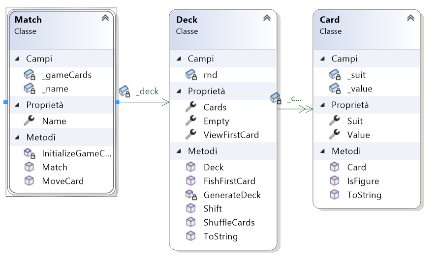

# Solitaire Trendy
solitaire card game, programme written in C# and WPF graphics 
## Analisi
### Classi
 
- Carta
    - seme
    - valore della carta

- mazzo di carte
    - lista carte base

- Partita
    - nome giocatore
    - mazzo di carte
    - array di liste tipo carta → rappresenta i gruppi di carte in scala durante la partita
    - array di liste carte base
    - array di liste carte in colonna
    - lista di carte estratte

---

## Gestione del problema

1. gestione delle classi
    - gestione della partita seguendo le regole stesso-seme | seme-diverso

2. gestione delle interazioni delle classi
    - gestione della partita e delle azioni del utente

3. gestione della partita e le interazioni I/O
    - gestione dello spostamento delle carte sul piano e della grafica WPF
    - gestione delle pagine/finestre

interazioni dell'utente → elaborazione delle azioni → risultato delle interazioni a schermo

---

# Regole del Gioco
il gioco utilizza un mazzo di carte italiane (40 carte: bastoni, spada, denare, coppe).
Lo scopo del Solitario è spostare tutte le carte sulle basi una per ogni seme in ordine crescente, iniziando dall’asso e finendo con il re.
Le carte nella parte destra dello schermo sono disposte in colonne, dove per ognuna di esse abbiamo un mazzetto con lo stesso numero di carte pari alla sua posizione.
Bisognerà spostare l’ultima carta del mazzo che sara visibile nelle basi o nelle colonne in modo che la carta precedente sia di seme diverso e di valore maggiore.
In caso una delle colonne sia vuota è possibile posizionarsi qualsiasi carta o scala(in ordine decrescente). 

# Mockup
[Figma mockup](https://www.figma.com/file/bw8lFJlJu9a8bjboqY78Od/Untitled?type=design&node-id=0%3A1&mode=design&t=RwEZo4qeLcdU5bsA-1)
